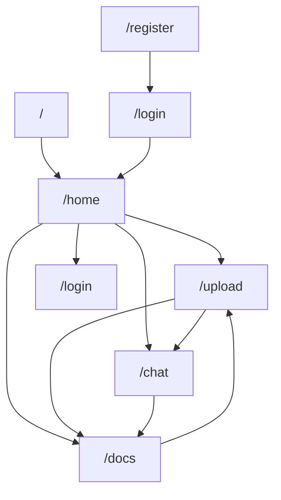

## 1. Product Overview
在不改变现有功能与路由的前提下，对“智能知识库”前端进行UI改版。
目标是提升整体视觉质感、信息层级清晰度与交互一致性，降低学习成本。

## 2. Core Features

### 2.1 User Roles
| 角色 | 注册/进入方式 | 核心权限 |
|------|--------------|----------|
| 未登录访客 | 访问 /login、/register | 仅可登录/注册，不可使用业务页面 |
| 已登录用户 | 邮箱+密码登录获得 token | 可访问主页、上传文档、文档管理、智能问答、退出登录 |

### 2.2 Feature Module
本次改版涉及以下页面（功能不变，仅UI/交互规范化）：
1. **应用框架（侧边栏+主内容区）**：品牌区、导航高亮、用户信息与退出入口。
2. **主页**：入口卡片（上传/问答）、快捷跳转。
3. **上传文档**：文件选择、上传状态、结果回显、下一步引导。
4. **文档管理**：文档列表表格、状态徽标、失败原因、删除/重传。
5. **智能问答**：会话列表、消息流（含Markdown）、输入与发送、来源展示。
6. **登录**：邮箱/密码表单、反馈提示、跳转注册。
7. **注册**：邮箱/验证码/密码表单、倒计时、反馈提示、跳转登录。

### 2.3 Page Details
| Page Name | Module Name | Feature description |
|-----------|-------------|---------------------|
| 应用框架 | 视觉与布局基线 | 统一页面容器宽度/间距/圆角/阴影；统一 topbar 与卡片标题层级；统一空状态/加载态占位样式 |
| 应用框架 | 导航一致性 | 保持现有路由不变；统一导航项 hover/active/disabled 样式与可点击区域；统一“退出”按钮在侧边栏底部的表现 |
| 主页 | 入口卡片 | 强化两张入口卡的信息层级（标题/描述/主按钮/次按钮）；统一卡片高度与按钮对齐 |
| 上传文档 | 上传交互 | 统一 file input 外观（可保持原生但增加容器/说明）；上传中/成功/失败反馈样式统一；结果JSON展示区统一为“代码面板”样式 |
| 文档管理 | 表格可读性 | 统一表头/行高/分隔线与对齐；状态徽标三态（PROCESSING/COMPLETED/FAILED）视觉一致；操作区控件对齐与密度统一 |
| 智能问答 | 双栏结构 | 保持左会话列表+右聊天区结构；会话项选中态/删除按钮 hover 呈现一致；聊天气泡与Markdown排版一致且可读 |
| 智能问答 | 输入区一致性 | 输入框与发送按钮在所有状态（默认/聚焦/禁用/发送中）风格一致；错误提示与来源信息使用统一信息条样式 |
| 登录/注册 | 表单一致性 | 统一输入框、按钮、帮助文案、成功/错误提示的组件规范；保持现有跳转与提示文案逻辑不变 |

## 3. Core Process
- 访客在**注册页**填写邮箱，获取验证码并完成注册后跳转登录。
- 访客在**登录页**输入邮箱+密码登录获取 token，自动跳转到来源页或 /home。
- 已登录用户在**主页**选择进入上传文档、文档管理或智能问答。
- 在**上传文档**完成上传后，可继续上传或跳转到智能问答/文档管理。
- 在**文档管理**查看处理状态，按需删除或为指定文档选择文件进行重传。
- 在**智能问答**可新建/切换/删除会话，发送问题并流式接收回答，查看来源。
- 任意页面可通过侧边栏**退出**返回登录页。

