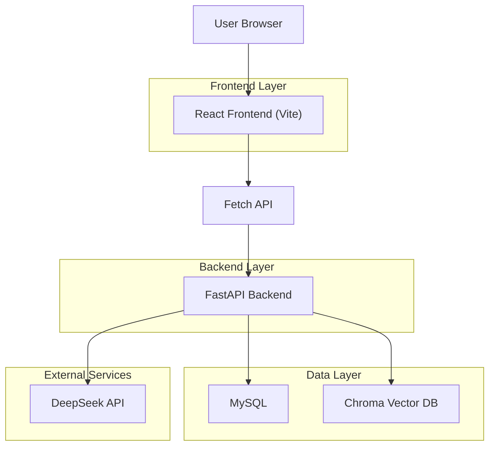

## 1.Architecture design

## 2.Technology Description
- Frontend: React@18 + react-router-dom@6 + Vite + 原生CSS（styles.css）
- Backend: FastAPI（现有服务，UI改版不涉及接口变更）
- Database: MySQL（用户/文档元数据/会话）
- Vector Store: Chroma（文档向量检索）

## 3.Route definitions
| Route | Purpose |
|-------|---------|
| / | 重定向到 /home |
| /login | 邮箱登录，获取 token |
| /register | 邮箱注册（含验证码） |
| /home | 主页入口（受保护） |
| /upload | 上传文档（受保护） |
| /docs | 文档管理（受保护） |
| /chat | 智能问答（受保护） |

## 4.API definitions (If it includes backend services)
### 4.1 Core API
认证与用户
- POST /auth/register_email
- POST /auth/send_code
- POST /auth/login_email
- GET /auth/me

文档
- POST /docs/upload
- GET /docs/
- DELETE /docs/{docId}
- PUT /docs/{docId}/reupload

聊天
- POST /chat/stream（流式返回 JSON 行）
- GET /chat/sessions
- POST /chat/sessions
- DELETE /chat/sessions/{sessionId}
- GET /chat/sessions/{sessionId}/messages
